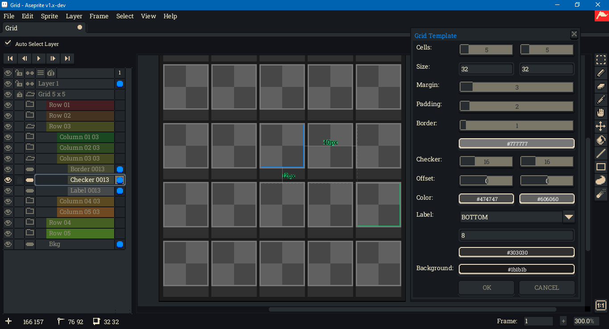

# Aseprite Grid Template Generator

This is a grid template generator for use with the [Aseprite](https://www.aseprite.org/) [scripting API](https://github.com/aseprite/api).

## Download

To download this script, click on the green Code button above, then select Download Zip. You can also click on the `gridTemplate.lua` file. Beware that some browsers will append a `.txt` file format extension to script files on download. Aseprite will not recognize the script until this is removed and the original `.lua` extension is used. There can also be issues with copying and pasting. Be sure to click on the Raw file button; do not copy the formatted code.

## Usage

To use this script, open Aseprite. In the menu bar, go to `File > Scripts > Open Scripts Folder`. Move the Lua script into the folder that opens. Return to Aseprite; go to `File > Scripts > Rescan Scripts Folder` (the default hotkey is `F5`). The script should now be listed under `File > Scripts`. Select `gridTemplate.lua` to launch the dialog.

If an error message in Aseprite's console appears, check if the script folder is on a file path that includes characters beyond [UTF-8](https://en.wikipedia.org/wiki/UTF-8), such as 'é' (e acute) or 'ö' (o umlaut).

A hot key can be assigned to the script by going to `Edit > Keyboard Shortcuts`. The search input box in the top left of the shortcuts dialog can be used to locate the script by its file name. Upon launching the dialog, the OK button will have focus. Holding down the `Alt` key and pressing `O` will create the grid. The dialog can be closed with `Alt+C`.

## Design Intent

This script creates a new sprite in RGB color mode. To convert to another color mode, go to `Sprite > Color Mode`.

It is intended for use in conjunction with the auto guide feature. The feature can be enabled by going to `View > Show > Auto Guides`. To display the guides, choose the [move tool](https://www.aseprite.org/docs/move-tool), then hold down the `Ctrl` key. This is the same key that engages `Auto Select Layer`. To change the guides' color, go to `Edit > Preferences`, then select the `Guides & Slices` section from the left-hand column.

For the script to work with auto guides, each grid element must be contained in a separate [cel](https://www.aseprite.org/docs/cel). This is why the script creates nested [layer group](https://www.aseprite.org/docs/layer-group)s. To flatten the grid to a single layer, select "Grid" in the timeline, then go to `Layer > Flatten`.

Each non-group layer is set to be [continuous](https://www.aseprite.org/docs/continuous-layers/). For the grid to persist across new frames, either click on the `+` button in the bottom right corner or go to `Frame > New Frame`. The grid will *not* persist if `Frame > New Empty Frame` is used.

Grid elements are intended for reference only, such as positioning elements created and styled by the user. They are not intended for use as visual elements in themselves. For that reason, they default to locked (not editable). A default, editable layer is left in the layer stack above the grid layer.

If the same grid will be reused, it is recommended to save it as a template `.aseprite` file.

## Issues

This script was tested in Aseprite version 1.3.2 on Windows 10. Its user interface elements were tested with 100% screen scaling and 200% UI scaling.

Please report issues in the [Issues](https://github.com/behreajj/AseGridTemplate/issues) section on Github. When reporting, please include the version of Aseprite used.